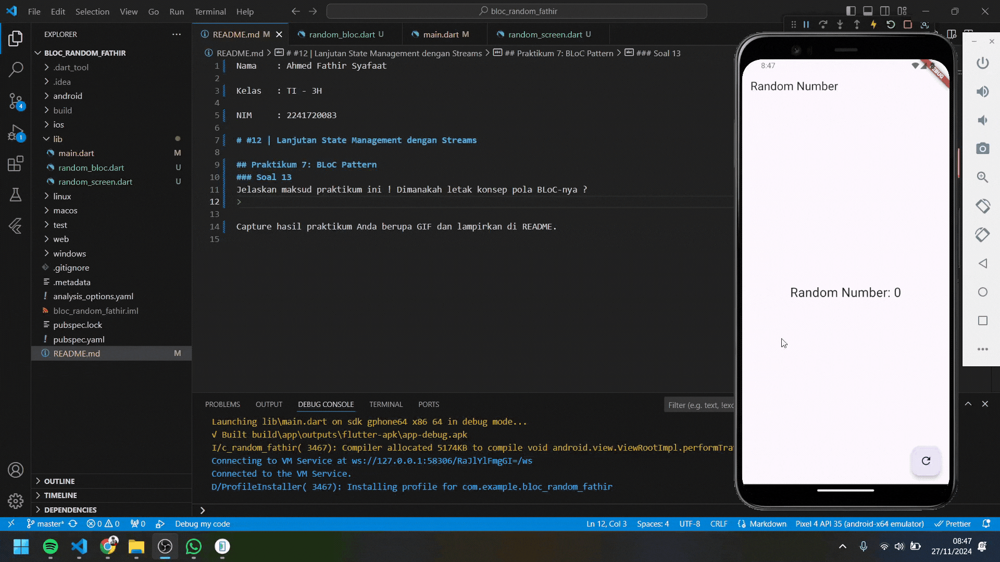

Nama    : Ahmed Fathir Syafaat

Kelas   : TI - 3H

NIM     : 2241720083

# #12 | Lanjutan State Management dengan Streams

## Praktikum 7: BLoC Pattern
### Soal 13
Jelaskan maksud praktikum ini ! Dimanakah letak konsep pola BLoC-nya ?
> Praktikum ini bertujuan untuk memahami dan menerapkan pola BLoC (Business Logic Component). Pola BLoC digunakan untuk memisahkan logika dari tampilan, sehingga aplikasi menjadi lebih terstruktur dan mudah untuk dikembangkan. Dalam praktikum ini, logika untuk menghasilkan angka acak ditempatkan di dalam kelas RandomNumberBloc, sedangkan tampilan aplikasi dikelola pada file random_screen.dart.

> Konsep pola BLoC terlihat dari cara interaksi antara logika dan tampilan yang menggunakan Stream. Tombol pada UI mengirimkan sinyal event ke BLoC melalui generateRandom. BLoC kemudian memproses sinyal tersebut, menghasilkan angka acak, dan mengirimkannya kembali ke UI melalui stream. UI menggunakan StreamBuilder untuk mendengarkan data yang dikirim oleh BLoC dan memperbarui tampilan sesuai dengan data tersebut.

Capture hasil praktikum Anda berupa GIF dan lampirkan di README.
